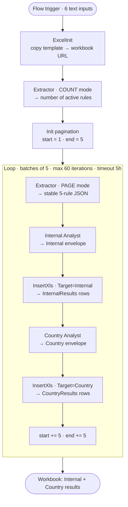

# 02 · The full‑AI architecture

> How the workload was decomposed into an **agent flow** plus **five single‑purpose agents**. The shape of
> this architecture is a direct consequence of the platform limits documented in
> [chapter 06](06-harness-limits-field-notes.md).

## The core idea

A single agent could not reliably process ~200 rules and all associated actions in one invocation. So the
work is broken into **pages of five rules**, and **the flow — not the agents — owns the loop**. Each agent
does one narrow job and nothing else.

*(Diagram source: [`assets/architecture.mmd`](../assets/architecture.mmd).)*

## The five agents

| Agent (role) | Model | Tools | Single responsibility |
| --- | --- | --- | --- |
| **ExcelInit** | GPT‑5.5 Chat | SharePoint MCP · Create file | Copy the workbook template, return **only** its URL. No content edits, no analysis. |
| **Extractor** | GPT‑5.5 Chat | Dataverse MCP | **COUNT** the active rules for the pack; in **PAGE** mode return a stable slice of ≤5 rules as JSON. No analysis. |
| **Internal Analyst** | GPT‑5.5 Chat | SharePoint MCP · web | Read the contract; judge the 5 rules against internal guidelines; emit the Internal envelope. |
| **Country Analyst** | GPT‑5.5 Chat | SharePoint MCP · web | Re‑judge the same 5 rules with **targeted** country research when relevant; emit the Country envelope. |
| **InsertXls** | GPT‑5.5 Chat | SharePoint MCP · Excel "Add a row" | Validate the envelope; add exactly one row per result to `InternalResults` or `CountryResults`. |

The **Internal** and **Country** analysts carry a **skill package** (Python + Markdown references) that
turns the model's judgement into a validated, deterministic output — see
[chapter 05](05-deterministic-output-pattern.md).

## Design principles behind the shape

- **The flow owns pagination, sequencing and termination.** Agents never decide "how many rules left".
- **One responsibility per agent.** An agent that both reads *and* writes *and* analyzes is where drift
  and "laziness" appear.
- **Tools are constrained by the prompt, not just by connection.** For example, ExcelInit may have an
  "Add a row" tool connected, yet its instructions forbid touching workbook content. Connected tools and
  the prompt boundary must be read together.
- **Memory is disabled.** Each agent call is stateless; nothing is silently carried between iterations.

## What is deliberately *not* here

An earlier design tried to reread all rules and all results at the end and synthesize a final workbook in
one shot. It was removed: it re‑introduced exactly the large‑single‑execution fragility the batching was
meant to avoid. Results are instead **accumulated incrementally** in the workbook during the loop.
