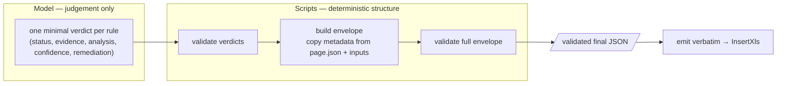

# 05 · The deterministic output pattern

> **The model judges; scripts build the output.** This single principle removed the most damaging class of
> failures we saw, and it is the most portable lesson in this report.

## The problem it solves

When you ask a language model to produce the **final** structured payload directly, it will occasionally:

- return an **intermediate** verdict object instead of the final envelope;
- **drop required fields** (`count`, `rule_identifier`, `comparison`, …);
- **mix languages** inside a machine contract (localized status/confidence values);
- leak **web citation markers** such as `[1]`, `[2]`, `[source]` into JSON text;
- silently **mutate** a value it was supposed to copy verbatim (we observed a single‑character change
  inside a source URL);
- "helpfully" **rebuild** an output that was already validated.

Any one of these breaks the downstream contract in [chapter 04](04-data-contracts.md).

## The pattern

Split responsibilities cleanly between the **model** and **deterministic scripts** shipped inside the
skill package:

*(Diagram source: [`assets/data-contract-flow.mmd`](../assets/data-contract-flow.mmd).)*

### The required chain

1. Save the stable **rule page**.
2. Retrieve and extract the **complete contract**.
3. Write **one minimal verdict per rule** to a working file (`verdicts.jsonl`).
4. **Validate** the verdict set.
5. **Build** `results.json` from the verdicts **plus** the stable page — scripts populate all root and rule
   metadata (`pack`, `count`, `rule_identifier`, `code`, `area`, `level`, `issue`, `rule`, `comparison`).
6. **Validate** the complete envelope against the schema.
7. **Emit the validated output verbatim** — no manual reconstruction after validation.

## Why it works

- The model only ever produces the part it is actually good at: **judgement**. It never has to remember or
  re‑type the metadata plumbing.
- **Metadata cannot drift**, because scripts copy it from inputs rather than asking the model to reproduce
  it.
- Validation is **deterministic and repeatable**; a malformed envelope fails loudly *before* it reaches
  the insertion agent.

## The cost

This robustness is not free: it **increases skill complexity and maintenance**. You are now shipping and
versioning Python validators/builders alongside prompts. For a one‑off task this is overkill; for a
long‑running, contract‑bound pipeline it pays for itself quickly.

The scripts and references that implement this pattern lived in the two analyst skill packages. Those
packages are **not shipped here** (they are client‑derived); this chapter describes the pattern in enough
detail to rebuild it.
